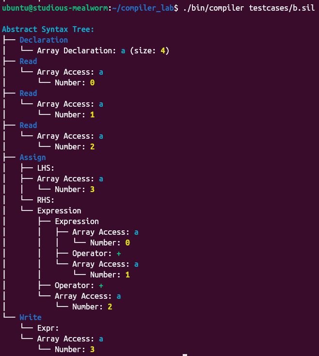
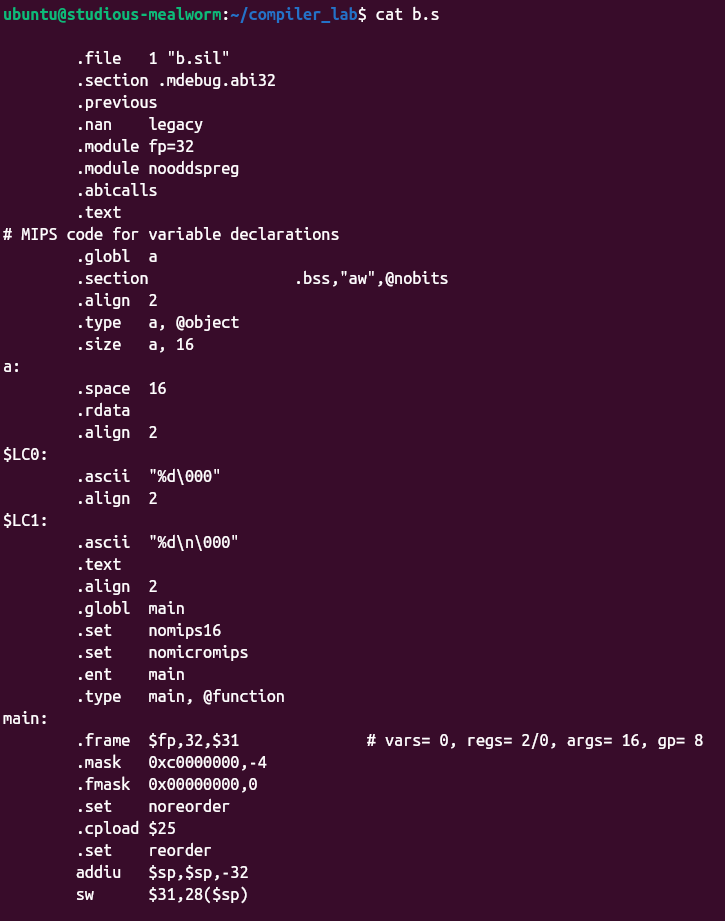

# SIL Compiler Architecture & Custom Structs

## Table of Contents

1. [Overview](#overview)
2. [Architecture](#architecture)
3. [Custom Data Structures](#custom-data-structures)
4. [SIL Language Pattern Recognition](#sil-language-pattern-recognition)
5. [Abstract Syntax Tree (AST) Structure](#abstract-syntax-tree-ast-structure)
6. [Code Generation](#code-generation)
7. [Usage Examples](#usage-examples)

## Overview

The SIL (Simple Imperative Language) Compiler is a comprehensive compiler implementation that translates SIL source code into MIPS assembly language. The compiler follows a traditional multi-phase architecture using Lex/Flex for lexical analysis and Yacc/Bison for syntactic analysis, followed by semantic analysis, AST construction, and MIPS code generation.

## Architecture

### 1. Lexical Analysis Phase (Lexer - `compiler.l`)

The lexer identifies and tokenizes SIL language constructs:

**Tokens Recognized:**

- **Keywords**: `main`, `return`, `read`, `write`, `integer`, `boolean`, `begindecl`, `enddecl`, `begin`, `end`, `if`, `then`, `else`, `endif`, `for`, `while`, `break`
- **Operators**: Arithmetic (`+`, `-`, `*`, `/`, `%`), Comparison (`==`, `!=`, `<=`, `>=`, `<`, `>`), Logical (`AND`, `OR`, `NOT`)
- **Literals**: Numbers, boolean values (`true`, `false`), string literals
- **Identifiers**: Variable and function names
- **Delimiters**: Parentheses, brackets, braces, semicolons, commas

**Comment Handling:**

- Single-line comments: `// comment`
- Multi-line comments: `/* comment */`

### 2. Syntactic Analysis Phase (Parser - `compiler.y`)

The parser builds an Abstract Syntax Tree (AST) using a context-free grammar that defines SIL's structure:

**Grammar Productions:**

```text
Prog → Gdecl_sec Fdef_sec MainBlock
Gdecl_sec → DECL Gdecl_list ENDDECL
MainBlock → BEG stmt_list END
statement → assign_stmt | read_stmt | write_stmt | cond_stmt | break_stmt
expr → NUM | VAR | expr op expr | '(' expr ')'
```

### 3. Semantic Analysis & AST Construction (`statement.c`)

The semantic analyzer validates type correctness and builds the final AST representation using custom data structures.

### 4. Code Generation Phase (`asm.c`)

Translates the AST into MIPS assembly language with proper register allocation and memory management.

## Custom Data Structures

### 1. Symbol Table Structure (`Symbol`)

```c
typedef struct Symbol {
    char *name;           // Identifier name
    SymbolType type;      // SYMBOL_INT or SYMBOL_INT_ARRAY
    SymbolValue value;    // Union holding int_value or int_array
    struct Symbol *next;  // Hash table collision resolution
} Symbol;
```

**Purpose:**

- **Pattern Detection**: Maintains runtime information about declared variables and arrays
- **Type Checking**: Ensures type compatibility during assignment and expression evaluation
- **Memory Management**: Tracks variable locations and array sizes for code generation

**Symbol Types:**

- `SYMBOL_INT`: Simple integer variables
- `SYMBOL_INT_ARRAY`: One-dimensional integer arrays

### 2. AST Node Structure (`Node`)

```c
typedef struct Node {
    NodeType type;  // NODE_EXPR, NODE_NUM, NODE_VAR, NODE_ARR, NODE_BOOL, NODE_DECL
    union {
        struct { OperationType op; Node *left; Node *right; } expr;
        struct { int num; } num;
        struct { char *var_name; } var;
        struct { char *var_name; Node *index; } arr;
        struct { bool is_true; } boolean;
        struct { ValueType type; ... Node *next; } decl;
    } data;
} Node;
```

**Purpose:**

- **Expression Representation**: Captures arithmetic, logical, and comparison operations
- **Variable Access**: Represents both simple variables and array accesses
- **Type Information**: Distinguishes between different data types and operations

**Node Types & Pattern Detection:**

- `NODE_EXPR`: Binary/unary expressions (detects operator precedence and associativity)
- `NODE_NUM`: Integer literals (detects numeric constants)
- `NODE_VAR`: Variable references (detects identifier usage)
- `NODE_ARR`: Array accesses (detects array indexing patterns)
- `NODE_BOOL`: Boolean literals (detects boolean constants)
- `NODE_DECL`: Declaration nodes (detects variable/array declarations)

### 3. Statement Structure (`Statement`)

```c
typedef struct Statement {
    StatementType type;  // STMT_ASSIGN, STMT_IF, STMT_FOR, STMT_WRITE, etc.
    union {
        struct { Node *var_expr; Node *expr; } assign_stmt;
        struct { Node *cond; Statement *then_stmts; Statement *else_stmts; } if_stmt;
        struct { Statement *init_stmt; Node *cond_stmt; Statement *update_stmt; Statement *stmts; } for_stmt;
        struct { bool is_string; union { char *string; Node *expr; } write_data; } write_stmt;
        struct { Node *var_expr; } read_stmt;
        struct { SymbolType type; Node *decls; } decl_stmt;
    } stmt_data;
    struct Statement *next;  // Linked list for statement sequences
} Statement;
```

**Purpose:**

- **Control Flow**: Manages conditional and iterative constructs
- **I/O Operations**: Handles input/output statement patterns
- **Declaration Management**: Processes variable and array declarations

## SIL Language Pattern Recognition

### Supported Language Constructs

| Pattern Category | Construct | Recognition Method | Example |
|------------------|-----------|-------------------|---------|
| **Declarations** | Variable/Array declarations | Parser grammar rules for `begindecl...enddecl` | `begindecl integer a, b[10]; enddecl` |
| **Assignments** | Variable and array assignments | AST nodes with LHS/RHS expressions | `a = b + 5; arr[i] = x;` |
| **Arithmetic** | Mathematical operations | Expression nodes with operator precedence | `result = a + b * c / d;` |
| **Comparisons** | Relational operations | Boolean expression evaluation | `if (a >= b) then ... endif` |
| **Logical** | Boolean operations | Short-circuit evaluation | `if (a > 0 AND b < 10) then` |
| **Control Flow** | Conditional and loops | Statement AST nodes | `if-then-else`, `for` loops |
| **I/O Operations** | Input/output statements | Special statement types | `read(a, b); write(result);` |
| **Comments** | Code documentation | Lexer state machines | `// single line`, `/* multi-line */` |

### Pattern Detection Process

1. **Lexical Recognition**: Tokenizes source code into meaningful symbols
2. **Syntactic Recognition**: Matches token sequences against grammar rules
3. **Semantic Validation**: Verifies type compatibility and variable declarations
4. **AST Construction**: Builds hierarchical representation of program structure

## Abstract Syntax Tree (AST) Structure

The AST provides a tree-like visualization of the program structure with colored output:

### AST Visualization Format

```text
Abstract Syntax Tree:
├── Declaration
│   ├── Variable Declaration: a
│   └── Array Declaration: b (size: 3)
├── Read
│   └── Variable: a
├── Assign
│   ├── LHS:
│   │   └── Array Access: b
│   │       └── Number: 0
│   └── RHS:
│       └── Expression
│           ├── Variable: a
│           ├── Operator: +
│           └── Number: 5
└── Write
    └── Expr:
        └── Array Access: b
            └── Number: 0
```

### Color-Coded AST Elements

- **Blue**: Statement types (Assign, For Loop, If Statement, etc.)
- **Cyan**: Variable and array names
- **Yellow**: Numeric literals
- **Magenta**: String literals and boolean values
- **Green**: Operators
- **Red**: Error conditions or null nodes

### AST Node Relationships

1. **Hierarchical Structure**: Parent-child relationships represent program flow
2. **Expression Trees**: Mathematical and logical expressions form sub-trees
3. **Statement Chains**: Sequential statements are linked as siblings
4. **Scope Management**: Declaration blocks maintain variable visibility

## Code Generation

The AST is traversed to generate MIPS assembly code:

### Generated Assembly Structure

1. **Data Section**: Variable and array declarations
2. **Text Section**: Executable code with proper labels
3. **Runtime Support**: System calls for I/O operations
4. **Register Management**: Efficient use of MIPS registers

### Example Code Generation

**SIL Input:**

```sil
begindecl
    integer a, b;
enddecl

begin
    read(a, b);
    write(a + b);
end
```

**Generated MIPS Assembly:**

```assembly
    .globl  a
    .section .bss,"aw",@nobits
    .align  2
    .type   a, @object
    .size   a, 4
a:
    .space  4
    
    # Read operations
    la      $4, $LC0
    la      $5, a
    jal     __isoc99_scanf
    
    # Addition operation
    la      $10, a
    lw      $2, 0($10)
    la      $10, b
    lw      $3, 0($10)
    addu    $2, $2, $3
    
    # Write operation
    la      $4, $LC1
    move    $5, $2
    jal     printf
```

## Usage Examples

### Compile and Run

1. **Install Prerequisites:**

   ```bash
   ./qemu.sh
   ```

2. **Build Compiler:**

   ```bash
   cd compiler/
   make
   ```

3. **Compile SIL Program:**

   ```bash
   ./bin/compiler sample.sil
   ```

4. **Generate MIPS Executable:**

   ```bash
   mips-linux-gnu-gcc-10 sample.s -o sample.o
   ```

5. **Run in QEMU:**

   ```bash
   qemu-mips -L /usr/mips-linux-gnu/ sample.o
   ```

### Sample Program

```sil
begindecl
      integer a[4];
enddecl

begin
      read(a[0]);
      read(a[1]);
      read(a[2]);
      a[3] = a[0] + a[1] + a[2]
      write(a[3]);
end
```

#### Sample Output

- AST

- MIPS Assembly file


The SIL compiler effectively recognizes these patterns through its multi-phase architecture, building appropriate AST representations, and generating efficient MIPS assembly code for execution.
